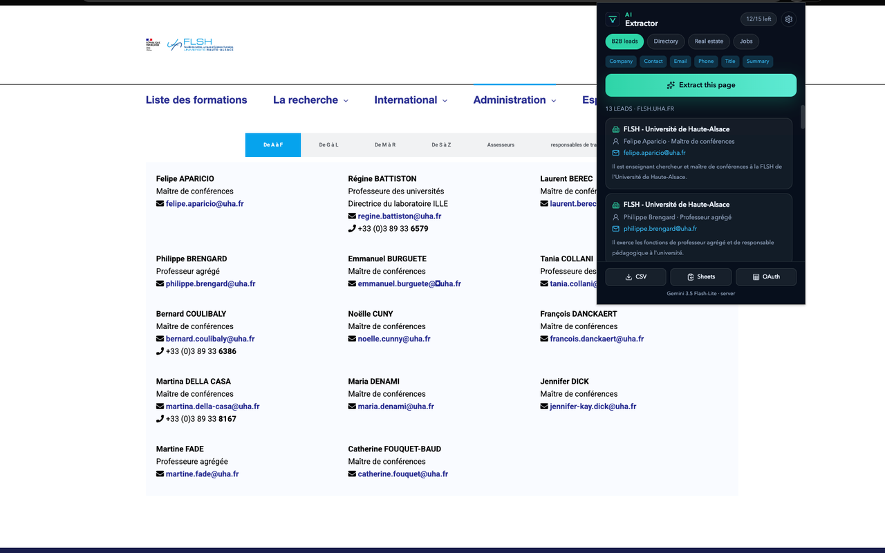

<div align="center">


# Extracteur IA

**Transforme n'importe quelle page web en base de contacts structurée, en un clic — grâce à l'IA.**

[](https://www.typescriptlang.org/)
[](https://react.dev/)
[](https://workers.cloudflare.com/)
[](https://developer.chrome.com/docs/extensions/mv3/intro/)
[]()

</div>

<br/>



## Le problème

Recruteurs, agents immobiliers et commerciaux passent des heures à copier-coller manuellement des informations de contact depuis des annuaires, des sites d'entreprises ou des annonces. **Extracteur IA** automatise ce travail : un clic sur une page web, et un modèle de langage en extrait les leads structurés (entreprise, contact, email, téléphone, poste), prêts à exporter.

## Fonctionnalités

- **4 modèles d'extraction** adaptés à des usages différents : leads B2B, annuaires professionnels, immobilier, offres d'emploi.
- **Nettoyage intelligent du DOM** côté client (Mozilla Readability + fallback texte intégral) avant tout appel réseau, pour ne transmettre que le contenu utile de la page.
- **Extraction par IA** (Google Gemini) avec sortie JSON strictement typée (`responseSchema`), exécutée **côté serveur** — la clé d'API n'est jamais exposée dans l'extension.
- **Export CSV et Google Sheets** (OAuth), en un clic.
- **Modèle freemium** : 15 extractions gratuites par mois, abonnement Pro illimité via Stripe Checkout.
- **6 langues** (FR, EN, ES, DE, IT, PT) avec détection automatique de la langue du navigateur.

## Architecture

Le principe central : **le navigateur ne voit jamais de clé d'API**. Toute la logique sensible (appel Gemini, quota, statut d'abonnement) vit sur un Worker Cloudflare ; l'extension ne fait que nettoyer la page et afficher le résultat.

```mermaid
flowchart LR
    A[Page web] -->|Readability + Turndown| B[Content script]
    B --> C[Service worker]
    C -->|HTTPS + installId anonyme| D[API Cloudflare Worker]
    D -->|clé API côté serveur| E[Gemini]
    D <-->|quota / statut Pro| F[(Cloudflare KV)]
    D -->|webhook signé| G[Stripe]
    D --> C
    C --> H[Popup : leads + export CSV/Sheets]
```



Le quota et le statut Pro sont **toujours vérifiés côté serveur** : le client ne peut jamais s'auto-attribuer un accès illimité, seul un paiement Stripe confirmé (signature webhook vérifiée par HMAC-SHA256) débloque le compte.

## Stack technique

| | |
|---|---|
| **Extension** | TypeScript, React 19, Vite + `@crxjs/vite-plugin`, Tailwind CSS, Manifest V3 |
| **Nettoyage de page** | `@mozilla/readability`, Turndown |
| **API** | Hono, déployée sur Cloudflare Workers, stockage Cloudflare KV |
| **IA** | Google Gemini (sortie JSON structurée via `responseSchema`) |
| **Paiement** | Stripe Checkout + webhooks |
| **Tests** | Vitest, JSDOM |

## Démarrage rapide

```bash
npm install
npm run server     # API locale → http://127.0.0.1:8787
npm run build      # build de l'extension → dist/
npm run demo       # sert une page de démo pour tester l'extraction
```

1. `chrome://extensions` → activer le mode développeur → « Charger l'extension non empaquetée » → sélectionner `dist/`
2. Ouvrir `http://127.0.0.1:4173/annuaire-b2b.html`
3. Cliquer sur l'icône de l'extension puis « Extraire cette page »

## Tests

```bash
npm run test        # suite unitaire (parsing, quota, extraction DOM, CSV)
npm run lint         # oxlint
```

## Déploiement

```bash
npx wrangler login
npx wrangler kv namespace create USERS
npx wrangler secret put GEMINI_API_KEY
npm run deploy       # déploie server/worker.ts sur Cloudflare Workers
```

Variables serveur (`server/.env`, voir `server/.env.example`) : `GEMINI_API_KEY`, `STRIPE_SECRET_KEY`, `STRIPE_PRICE_ID`, `STRIPE_WEBHOOK_SECRET`, `PUBLIC_URL`.

## Sécurité & confidentialité

- Aucune clé d'API (Gemini, Stripe) n'est jamais présente dans le code de l'extension.
- Le statut Pro n'est accordé que par un webhook Stripe dont la signature est vérifiée cryptographiquement — jamais par une valeur envoyée depuis le client.
- Pas de compte utilisateur : l'usage est identifié par un identifiant anonyme généré localement (`crypto.randomUUID()`).
- [Politique de confidentialité](https://claude.ai/artifact/D6Hf6XZYwzxdMwe3axCieD)

## Roadmap

- [x] Extraction multi-modèles (B2B, annuaire, immobilier, emploi)
- [x] Facturation Stripe + quota serveur
- [x] Internationalisation (6 langues)
- [ ] Publication sur le Chrome Web Store (revue en cours)
- [ ] Export vers d'autres CRM

## Licence

Projet propriétaire — tous droits réservés.
